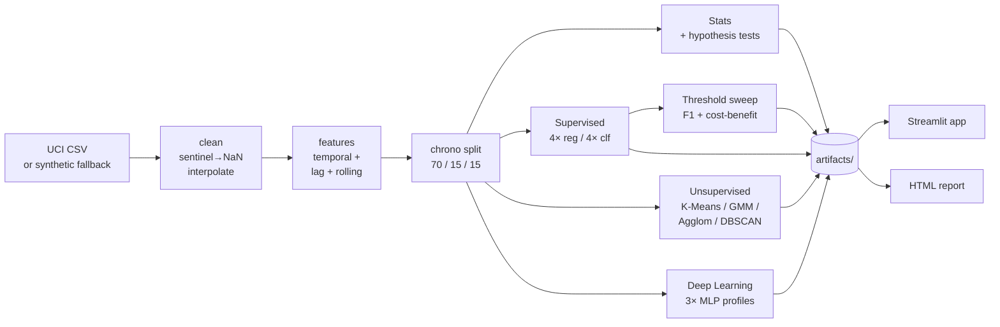

# Environmental Quality ML Dashboard

End-to-end ML pipeline for urban air-quality risk, served as a Streamlit
dashboard. Ships with pre-trained artifacts so the demo runs immediately
on first launch — no training step required.

[](https://github.com/joshuanguyen123/environmental-quality-ml-dashboard/actions/workflows/ci.yml)
[](https://www.python.org/downloads/release/python-3110/)
[](https://streamlit.io/)
[](https://github.com/astral-sh/ruff)
[](LICENSE)

> **Live demo:** add your Streamlit Cloud URL here once deployed (see [docs/DEPLOY.md](docs/DEPLOY.md)).


> _Capture a screenshot of the Executive Summary tab and save it to `docs/img/dashboard.png` to populate the image above._

## What it is

- **Eleven trained models** — four regressors (Linear, Random Forest, Extra Trees, HistGB), four classifiers, three MLPs, and four clustering algorithms — all benchmarked against the same chronologically-split UCI Air Quality dataset.
- **A polished Streamlit dashboard** that surfaces the metrics, diagnostics, and visualisations across seven tabs, including a live Open-Meteo weather feed.
- **A reproducible pipeline** — one `make train` regenerates every metric, plot, and table from raw data in under a minute.

## Quickstart

```bash
git clone https://github.com/joshuanguyen123/environmental-quality-ml-dashboard.git
cd environmental-quality-ml-dashboard

make setup     # install dependencies (Python 3.11+)
make demo      # launch the Streamlit dashboard
```

Pre-built artifacts ship with the repo, so `make demo` shows a populated
dashboard immediately. To regenerate everything from raw data, run
`make train` (≈30–60 seconds).

> Hitting issues on Windows? See [docs/TROUBLESHOOTING.md](docs/TROUBLESHOOTING.md).

## Architecture



For a detailed module-by-module walkthrough, see [docs/ARCHITECTURE.md](docs/ARCHITECTURE.md).

## What's inside the dashboard

| Tab | What it shows |
|---|---|
| **Executive Summary** | Headline metrics, model comparison table, one-glance verdict |
| **Statistical Overview** | Descriptive stats, correlation heatmap, three hypothesis tests |
| **Supervised Models** | Regression diagnostics, classification metrics, ROC / PR / calibration curves, confusion matrices |
| **Unsupervised Regimes** | Silhouette / Davies-Bouldin scores, t-SNE projection, cluster profiles |
| **Deep Learning Benchmark** | MLP training curves, regression and classification metrics across three architectures |
| **Policy Implications** | Cost-benefit threshold sweep, optimal F1 vs expected-value thresholds |
| **Live Weather (API)** | Open-Meteo forecast for any city — keyless, refreshes every 1–5 minutes |

## Headline numbers

Computed on the synthetic dataset (deterministic, seed=42). See
[docs/MODEL_CARD.md](docs/MODEL_CARD.md) for the full performance table.

| Task | Best model | Metric |
|---|---|---|
| NO₂ regression | Linear Regression | R² = 0.691, RMSE = 25.3 µg/m³ |
| High-pollution classification | Logistic Regression | ROC-AUC = 0.923, F1 = 0.623 |
| Environmental clustering | K-Means (k=4) | Silhouette = 0.154 |
| Threshold optimisation | — | Best EV threshold = 0.178 |

## Reproducing results

```bash
make train      # full 7-stage pipeline → artifacts/
make report     # render artifacts/reports/final_report.html
make app        # launch Streamlit
make verify     # ruff + unit tests
make clean      # drop intermediate data + joblib models (keeps committed artifacts)
```

The pipeline takes ~30–60s on a modern laptop. Random seeds are pinned in
`configs/project.yaml` and `configs/models.yaml`, so numbers are stable
across runs.

## Repository tour

<details>
<summary>Click to expand</summary>

```
environmental-quality-ml-dashboard/
├── README.md                  ← you are here
├── LICENSE                    ← MIT
├── Makefile                   ← setup / demo / train / report / verify
├── pyproject.toml             ← package + ruff + pytest config
├── requirements.txt
├── runtime.txt / .python-version
├── .streamlit/
│   ├── config.toml            ← headless + XSRF + usage stats off
│   └── secrets.toml.example
├── .github/workflows/ci.yml   ← lint + unit tests + smoke job
├── app/
│   ├── app.py                 ← Streamlit dashboard (7 tabs)
│   └── style.css              ← brand styling
├── configs/
│   ├── project.yaml           ← paths, columns, seeds
│   ├── models.yaml            ← hyperparameters for 11 models
│   └── thresholds.yaml        ← regulatory threshold + cost-benefit weights
├── src/
│   ├── data/                  ← ingest, clean, chrono split, schema validation
│   ├── features/              ← engineer, preprocessing
│   ├── stats/                 ← descriptive, hypothesis, diagnostics
│   ├── models/                ← supervised, unsupervised, deep_learning, evaluation
│   ├── business/              ← cost-benefit threshold sweep
│   └── utils/                 ← io, logging, plotting
├── scripts/
│   ├── fetch_data.py          ← load real UCI CSV or synthetic fallback
│   ├── train_all.py           ← 7-stage pipeline
│   ├── build_report.py        ← render HTML report from artifacts
│   └── run_app.py
├── tests/                     ← unit tests + slow smoke test
├── data/                      ← raw / interim / processed (gitignored)
├── artifacts/                 ← metrics, figures, tables, reports (committed)
└── docs/
    ├── MODEL_CARD.md
    ├── ARCHITECTURE.md
    ├── DEPLOY.md
    └── TROUBLESHOOTING.md
```

</details>

## Deploy to Streamlit Community Cloud

1. Push this repo to GitHub.
2. Visit [share.streamlit.io](https://share.streamlit.io/) → **New app**.
3. Set the entry file to `app/app.py`, branch to `main`, Python to 3.11.
4. Deploy. The build takes ~3–5 minutes; pre-built artifacts mean the dashboard is fully populated on first load.

Full step-by-step guide and self-hosting Dockerfile in [docs/DEPLOY.md](docs/DEPLOY.md).

## Dataset

**Source:** UCI Machine Learning Repository — [Air Quality Dataset](https://archive.ics.uci.edu/ml/datasets/Air+Quality). Hourly readings from one Italian city, March 2004 – February 2005, ~9,357 valid hours from five metal-oxide sensors plus a co-located reference analyser.

**Synthetic fallback:** When the real CSV is absent, `src/data/ingest.py` generates a seeded synthetic dataset preserving the original's marginal distributions, traffic-driven diurnal patterns, and cross-sensor correlations. This keeps the pipeline runnable out-of-the-box. To use real data, place the UCI CSV at `data/raw/air_quality.csv`.

## Design decisions

- **Chronological splits.** Random splits leak future information into training. The pipeline uses strict temporal 70 / 15 / 15.
- **Lag features shifted by 1.** Rolling means use `.shift(1)` so a row's features only depend on data prior to that row.
- **Welch's t-test over Student's.** Welch does not assume equal variance — more robust for environmental data where variance differs across regimes.
- **Permutation importance.** Tree-based importance is biased toward high-cardinality features; permutation importance is model-agnostic and unbiased.
- **sklearn MLP over PyTorch.** Minimal dependencies; the architecture is functionally equivalent.
- **Configs are externalised.** Hyperparameters, thresholds, and paths live in `configs/` rather than being hardcoded.

## Limitations

- **Temporal autocorrelation** violates independence assumptions in all three hypothesis tests. Each result includes an explicit caveat.
- **Single monitoring site** — generalisation beyond this Italian station is not established.
- **Sensor drift** — metal-oxide sensors drift over months; the 12-month window may capture drift that confounds genuine temporal patterns.
- **Synthetic data caveat** — when run without the real UCI CSV, headline numbers are illustrative, not definitive.
- **No hyperparameter tuning** — production deployments would use time-series-aware cross-validation (expanding window).

See [docs/MODEL_CARD.md](docs/MODEL_CARD.md) for the full set of caveats.

## License

[MIT](LICENSE).
