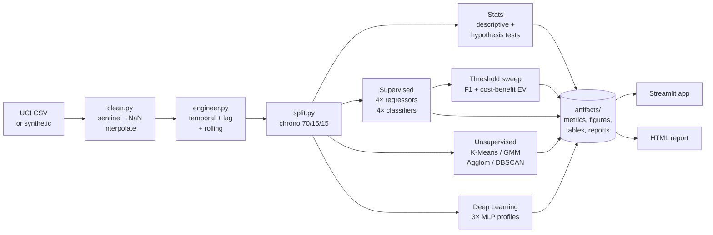

# Architecture

This document explains how the pipeline fits together so you can navigate
the codebase and pick the right module to read or extend.

## High-level flow



## Module map

```
src/
  data/
    ingest.py          load_or_generate(), generate_synthetic_air_quality(),
                       validate_schema()  ← raises SchemaError on bad UCI CSV
    clean.py           clean()  ← parses Date+Time, replaces -200, interpolates
    split.py           chronological_split()  ← strict temporal 70/15/15
  features/
    engineer.py        engineer_features()  ← Hour/Hour_sin/lags/rolling
    preprocessing.py   prepare_xy(), build_preprocessor()
  stats/
    descriptive.py     mean / variance / skew / kurtosis + Pearson corr
    hypothesis.py      Welch t-test, seasonal ANOVA, chi-square
    diagnostics.py     VIF, Shapiro-Wilk, Durbin-Watson
  models/
    supervised.py      Linear, RF, ExtraTrees, HistGB (regression + classification)
    unsupervised.py    K-Means, GMM, Agglomerative, DBSCAN, t-SNE
    deep_learning.py   MLP regressor + classifier with manual early stopping
    evaluation.py      regression_metrics(), classification_metrics(),
                       ROC / PR / calibration data, permutation importance
  business/
    threshold_analysis.py  threshold_sweep()  ← F1 + expected-value optimisation
  utils/
    io.py              YAML config loaders, JSON / CSV / joblib I/O
    plotting.py        publication-quality matplotlib/seaborn figures
    logging.py         setup_logging()  ← shared by scripts
```

```
scripts/
  fetch_data.py     Load real UCI CSV or generate synthetic fallback
  train_all.py      7-stage pipeline orchestrator (~30–60 s end-to-end)
  build_report.py   Render artifacts/ to a self-contained HTML report
  run_app.py        Launch Streamlit
```

```
app/
  app.py            Streamlit dashboard (7 tabs); reads artifacts/ only,
                    does not perform live training
  style.css         Brand styling (EcoAnalytics topbar, chips, panels)
```

```
configs/
  project.yaml      Paths, column names, datetime column, missing sentinel
  models.yaml       Hyperparameters for all 11 models + split ratios
  thresholds.yaml   NO₂ regulatory threshold, cost-benefit weights, seasons
```

```
artifacts/
  metrics/    JSON metric files (committed; ~50 KB)
  figures/    PNG plots (committed; ~2 MB)
  tables/     CSV comparison tables (committed; ~10 KB)
  reports/    Self-contained HTML report (committed; ~2 MB)
  models/     Joblib model pipelines (NOT committed; ~170 MB; reproducible)
```

## Reading order

If this is your first time in the codebase:

1. `README.md` for the pitch and quickstart.
2. `app/app.py` — top-to-bottom, to see what the dashboard surfaces.
3. `scripts/train_all.py` — the 7-stage pipeline; each stage is a comment block.
4. `src/data/ingest.py` and `src/features/engineer.py` — the no-leakage feature design.
5. `src/models/evaluation.py` and `src/business/threshold_analysis.py` — the metrics story.
6. `docs/MODEL_CARD.md` — performance + caveats.

## Reproducibility guarantees

- All RNG seeds are fixed (`random_state=42` in models.yaml; same seed in synthetic generator).
- Splits are chronological — no shuffling, no leakage from future to past.
- Lag and rolling features use `.shift(...)` so a row's features only depend on data prior to that row.
- `make train` regenerates every committed artifact except the raw 170 MB joblib models.

## Failure-mode notes

- **Wrong column names in real CSV:** `validate_schema()` raises `SchemaError` with the offending file path and the missing columns.
- **Missing artifacts when launching the app:** `load_metric_file()` shows a warning and the affected panel; the rest of the dashboard keeps working. Committed artifacts mean this rarely fires.
- **Open-Meteo unreachable:** the Live Weather tab catches `URLError` / timeouts and shows a "service temporarily unavailable" message; other tabs are unaffected.
